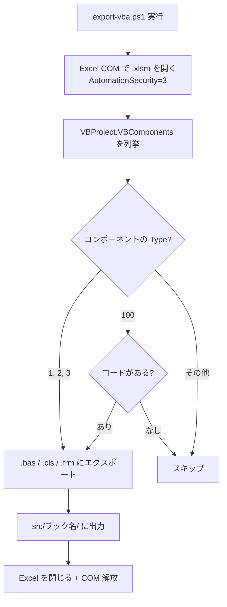
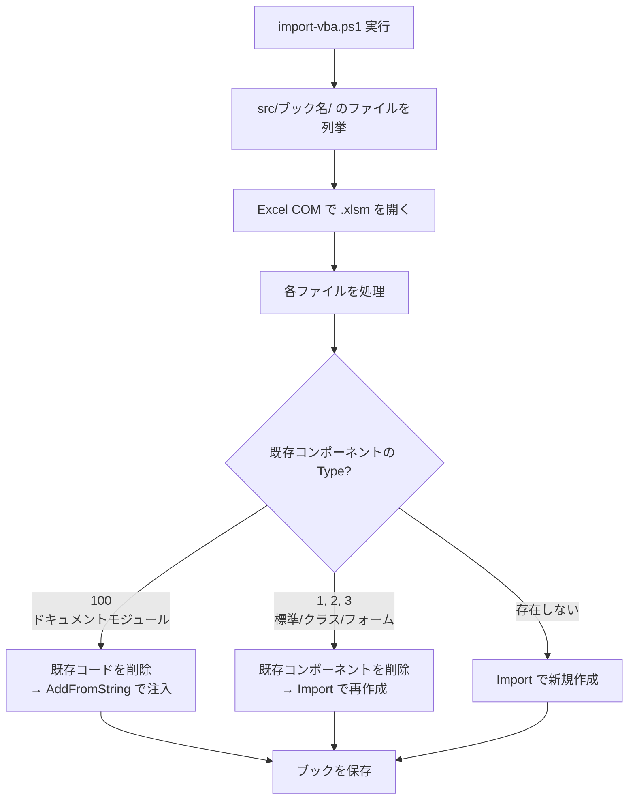

# Excel VBAのバージョン管理をあきらめなくていいかも

Excel VBA のマクロ開発をやっていると、ソースコード管理の壁にぶつかる。`.xlsm` はバイナリファイルなので `git diff` しても意味不明な文字列が出てくるだけだし、「あの変更いつやったっけ？」を調べる手段がない。

自分の場合、仕事で使う Excel マクロがそこそこ育ってきて、「これ壊したら終わりだな」という恐怖を感じるようになった。バックアップとして `★契約進行表 - コピー.xlsm` みたいなファイルが増えていくのを見て、「これはアカン」と思った。

そこで、**Git のコミット時に VBA のソースコードを自動でテキストファイルとしてエクスポートする仕組み**を作った。これで `.bas` や `.cls` ファイルとして差分が見えるようになった。思ったよりシンプルにできたので、汎用的に使える形にまとめてみる。

## 仕組みの全体像

やっていることはシンプルで、`git commit` のタイミングで VBA のソースコードをテキストファイルに書き出して、それも一緒にコミットする。


使うツールは3つ。

- **[lefthook](https://github.com/evilmartians/lefthook)** — Git フックを YAML で管理できるツール。pre-commit で PowerShell スクリプトを呼ぶのに使う
- **PowerShell 7+** — Excel COM オートメーションでワークブックを操作する
- **Excel COM** — VBA プロジェクトのコンポーネントをファイルにエクスポートする API

## 前提条件

- Windows（Excel COM を使うので macOS/Linux では動かない）
- Excel デスクトップ版（Microsoft 365 の Web 版は不可）
- [PowerShell 7+](https://github.com/PowerShell/PowerShell)（`pwsh` コマンドが使えること）
- [Git for Windows](https://gitforwindows.org/)
- [lefthook](https://github.com/evilmartians/lefthook) v1.6.1 以上

## セットアップ

### 1. lefthook のインストール

```powershell
winget install evilmartians.lefthook
```

または [Releases ページ](https://github.com/evilmartians/lefthook/releases) からバイナリを直接ダウンロードしても OK。

### 2. リポジトリにファイルを配置する

このリポジトリの以下のファイルをプロジェクトにコピーする。

```
your-project/
├── scripts/
│   ├── export-vba.ps1     ← VBA エクスポート
│   └── import-vba.ps1     ← VBA インポート（ソース → Excel に書き戻す）
├── lefthook.yml           ← pre-commit フックの設定
├── .gitignore             ← Excel 一時ファイル除外
└── .gitattributes         ← Shift-JIS の diff 表示対応
```

### 3. lefthook を有効にする

```powershell
cd your-project
git init          # まだ Git リポジトリでなければ
lefthook install  # pre-commit フックがインストールされる
```

### 4. Excel のトラスト センターを設定する

PowerShell から Excel の VBA プロジェクトにアクセスするには、Excel 側で許可が必要になる。

1. Excel を開く
2. **ファイル → オプション → トラスト センター → トラスト センターの設定**
3. 左メニューから **マクロの設定** を選択
4. **「VBA プロジェクト オブジェクト モデルへのアクセスを信頼する」** にチェックを入れる
5. OK で閉じる

この設定をしないと `export-vba.ps1` が `programmatic access` エラーで失敗する。セキュリティ的に気になる人もいると思うが、自分の開発マシンでの設定なので、リスクは限定的だと思っている。

### 5. 動作確認

```powershell
# .xlsm ファイルを Git に追加してコミットしてみる
git add MyWorkbook.xlsm
git commit -m "test: VBA エクスポートの動作確認"
```

コミット時に lefthook が `export-vba.ps1` を実行して、`src/MyWorkbook/` ディレクトリに VBA ソースファイルが生成される。`stage_fixed: true` の設定により、生成されたファイルは自動的にステージングされてコミットに含まれる。

## 使い方

### 自動エクスポート（コミット時）

普通にコミットするだけ。`.xlsm` ファイルがステージされていると lefthook が自動でエクスポートしてくれる。

```powershell
git add MyWorkbook.xlsm
git commit -m "feat: 売上計算ロジックを修正"
# → lefthook が export-vba.ps1 を実行
# → src/MyWorkbook/*.bas, *.cls が自動生成・ステージされる
# → .xlsm と src/ が一緒にコミットされる
```

### 手動エクスポート

コミットせずにエクスポートだけしたいときは直接スクリプトを実行する。

```powershell
pwsh scripts/export-vba.ps1 MyWorkbook.xlsm
```

複数ファイルにも対応している。

```powershell
pwsh scripts/export-vba.ps1 Book1.xlsm Book2.xlsm
```

### インポート（ソースから .xlsm に書き戻す）

`src/` のファイルを編集してワークブックに反映したいときに使う。たとえば、同僚が VBA を修正して `src/` のファイルだけ push してきたような場合。

```powershell
pwsh scripts/import-vba.ps1 MyWorkbook.xlsm
```

> **注意:** インポートはワークブックを上書き保存する。実行前にバックアップを取ることをおすすめする。

## 仕組みの詳細

### ディレクトリ構造

エクスポートすると以下のような構造になる。

```
your-project/
├── MyWorkbook.xlsm          ← Excel ファイル（バイナリ）
├── src/
│   └── MyWorkbook/           ← ブック名のディレクトリ
│       ├── ThisWorkbook.cls  ← ドキュメントモジュール
│       ├── Sheet1.cls        ← シートモジュール（コードがある場合のみ）
│       ├── Module1.bas       ← 標準モジュール
│       └── UserForm1.frm    ← ユーザーフォーム
├── scripts/
│   ├── export-vba.ps1
│   └── import-vba.ps1
└── ...
```

ブックごとに `src/<ブック名>/` にまとまるので、1つのリポジトリで複数のワークブックを管理できる。

### VBA コンポーネントの種類と処理方法

VBA には4種類のコンポーネントがあって、それぞれ扱い方が違う。

| Type | 拡張子 | 説明 | エクスポート | インポート |
|------|--------|------|-------------|-----------|
| 1 | `.bas` | 標準モジュール | `Export` | 削除 → `Import` |
| 2 | `.cls` | クラスモジュール | `Export` | 削除 → `Import` |
| 3 | `.frm` | ユーザーフォーム | `Export` | 削除 → `Import` |
| 100 | `.cls` | ドキュメントモジュール | `Export`（コードありのみ） | `DeleteLines` → `AddFromString` |

ポイントは **Type 100（ドキュメントモジュール）** の扱い。`ThisWorkbook` や `Sheet1` などは Excel が管理しているオブジェクトなので、削除して再インポートすることができない。代わりに、既存のコードを消してから新しいコードを注入する方法で差し替える。

### エクスポートの流れ



`AutomationSecurity = 3` は、ワークブックを開くときにマクロの自動実行を抑止する設定。エクスポートのためだけに開いているので、余計なマクロが走らないようにしている。

### インポートの流れ



インポート時のポイントは、ソースファイルの先頭にある VBA ヘッダ（`VERSION`、`BEGIN...END`、`Attribute` 行）を適切にスキップすること。ドキュメントモジュールに `AddFromString` で注入するときは、コード本体だけを渡す必要がある。

## エンコーディングの話

Excel の VBA エクスポートは **Shift-JIS（コードページ 932）** でファイルを出力する。これは Excel/VBA の仕様で変更できない。

何もしないと `git diff` で日本語が文字化けするが、`.gitattributes` で対応できる。

```gitattributes
*.bas diff working-tree-encoding=Shift_JIS
*.cls diff working-tree-encoding=Shift_JIS
```

この設定を入れておけば、`git diff` で日本語のコメントや文字列リテラルが正しく表示される。

### エディタでの表示

VS Code を使っている場合は、Shift-JIS のファイルを自動検出して正しく表示してくれる。手動で設定するなら:

```json
{
  "files.autoGuessEncoding": true
}
```

### UTF-8 にしたい場合

GitHub 上でソースを読みたいなど、UTF-8 で管理したい場合はエクスポート後に変換するスクリプトを追加する方法がある。ただし、インポート時に Shift-JIS に戻す変換が必要になるので、仕組みが複雑になる。個人的にはシンプルさ優先で Shift-JIS のまま使っている。

## 既知の制限・注意点

- **Excel のインストールが必要。** COM オートメーションを使うので、Excel がインストールされていないマシンでは動かない。CI/CD 環境での利用は現実的ではない
- **Trust Center の設定が必要。** マシンごとに1回設定する必要がある
- **Excel が開いていると競合する場合がある。** エクスポート/インポート中は対象のワークブックを閉じておくこと
- **ユーザーフォーム (.frm) にはバイナリデータが含まれる。** フォームのレイアウト情報はバイナリなので、テキストとして diff を取ることはできない
- **日本語ファイル名は動く。** `★テスト.xlsm` のような名前でもエクスポートできる（実際に使っている）

## lefthook.yml の解説

```yaml
pre-commit:
  commands:
    export-vba:
      glob: "*.xlsm"
      run: pwsh -File scripts/export-vba.ps1 {staged_files}
      stage_fixed: true
```

- `glob: "*.xlsm"` — `.xlsm` ファイルがステージされているときだけフックを実行する
- `{staged_files}` — lefthook がステージされたファイルのパスに展開してくれるテンプレート変数
- `stage_fixed: true` — フック実行中に変更されたファイル（ここでは `src/` 以下）を自動的にステージングする。これがないと `git add src/` を手動で実行する必要があり、面倒だった

`stage_fixed` は lefthook 1.6.1 で追加された機能。それ以前のバージョンでは `run` の中で `git add` する必要がある。

## トラブルシューティング

### 「programmatic access to VBA project」エラー

Excel のトラスト センターで VBA プロジェクトへのアクセスが許可されていない。[セットアップの手順 4](#4-excel-のトラスト-センターを設定する) を参照。

### エクスポートされるファイルが空

ワークブックに VBA コンポーネントが含まれていない可能性がある。Alt + F11 で VBA エディタを開いて確認する。

### Excel プロセスが残る

エラーで異常終了した場合、バックグラウンドに Excel プロセスが残ることがある。タスクマネージャーで `EXCEL.EXE` を終了させる。

```powershell
# PowerShell でまとめて終了する場合
Get-Process excel -ErrorAction SilentlyContinue | Stop-Process
```

### git diff で日本語が文字化ける

`.gitattributes` が正しく設定されているか確認する。このリポジトリの `.gitattributes` をコピーすれば OK。

## ファイル構成

```
xlsm-vba-git/
├── README.md              ← この記事
├── scripts/
│   ├── export-vba.ps1     ← VBA エクスポートスクリプト
│   └── import-vba.ps1     ← VBA インポートスクリプト
├── lefthook.yml           ← pre-commit フック設定
├── .gitignore             ← Excel 一時ファイル除外
├── .gitattributes         ← Shift-JIS diff 対応 + バイナリ設定
├── sample/
│   └── README.md          ← サンプルワークブック作成手順
└── LICENSE                ← MIT License
```

## ライセンス

MIT License
